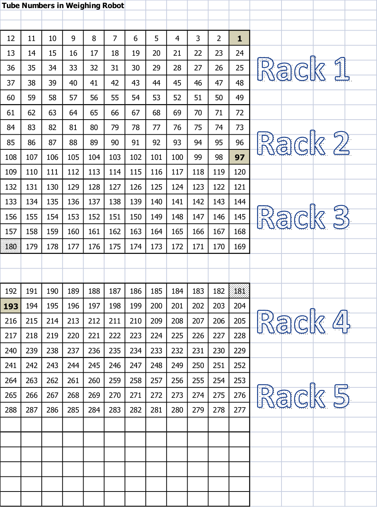
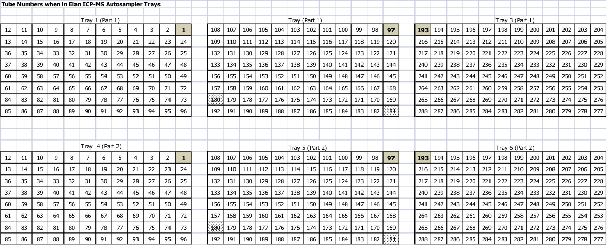

```{r setup, include=FALSE}
knitr::opts_chunk$set(echo = TRUE)
```

## Sample Preparation for Seed/Leaf/Root/Shoot samples

1. Weigh out tissue into digestion tube (acid washed 11ml 16mmx100mm borosilicate glass)
    1. Use weighing robot for seeds between 50 and 400 milligrams, see weighing robot protocol for procedure and maintenance.
        1. Sort into 48-well trays following template on computer with balance.
            1. Use YYMMDDpX Sample Log.csv for file name, if you want add short description YYMMDDpX Sample Log (short description).csv
    1. For leaves, roots, and shoots:
        1. Dry tissue in coin envelopes in 50C oven for minimum of 48 hrs.
        1. Homogenize tissue (hand crushing is usually sufficient, but mortar and pestle can be used)
        1. Subsample and weigh 75mg (if possible) into test tube.
        1. Name with YYMMDDpX Sample Log and Weights.csv or YYMMDDpX Sample Log and Weights (short description).csv
        + **Note**: Hand-weighed samples should be recorded into spreadsheet in grams using the balances automated button.
    1. See tube number diagram for tube numbering (Figure \ref{fig:rackdiag}).
    1. See appendix for protocols used for more diverse samples.
1. Pre-Digestion: 
    1. If average sample size is greater than 25mg:
        1. Add 2.5 ml HNO$_3$ soln (HNO$_3$ soln = 20 ppb In in conc HNO$_3$; 50$\mu$L of 1000 ppm Indium added to **new** 2.5 L bottle of conc HNO$_3$).
    1. For experiments where average sample is less than 25mg:
        1. Add 1 ml HNO$_3$ soln (HNO$_3$ soln = 20 ppb In in conc HNO$_3$; 50$\mu$L of 1000 ppm Indium added to **new** 2.5 L bottle of conc HNO$_3$).
    + **Note**: This is the most important step of sample preparation. Be certain the bottle-top dispenser is working properly (watch for air in the dispenser syringe) and make sure that each pump is delivering the correct amount to each tube. Accuracy can be checked gravimetrically if necessary.
1. Put tubes in heating blocks.
1. Let stand at room temperature for minimum of 1.5 hours (typically overnight), to prevent boiling over.
1. Digestion: Turn on warming block, set to maximum temperature (~95C). Digest for minimum of 4 hrs (until clear, with no residue on sides).
    + Digest all samples that will be run together for the same amount of time.
1. Turn off heating block and let cool for about 1 hr. Move samples back into test tube racks.
1. Dilute 4x with 18M$\Omega$ H$_2$O (UPW):
    1. Large samples experiments (average >25mg):
        1. Dilute to 10 ml (about 7.7 ml, estimate based on amount of evaporation).
    1. Small samples experiments (average <25mg):
        1. Dilute to 4 ml (about 3 ml, estimate based on amount of evaporation).
1. Mix with stirring rod block.
    + Rinse stirring rod block between racks in 10% HNO$_3$ solution.
    + **Note**: Getting a homogeneous mixture in this step is very important. We have tested doing this by: Shaking the tubes, pipetting up and down, and letting samples heat after dilution. All of these resulted in more variability of Indium, indicating poor mixing of the acid in the final sample. 
1. Transfer 1.2 mL of sample to 96-well autosampler tray and load on autosampler (Figure \ref{fig:asmap}).
    + **Note**: The orange sticker is placed on the autosampler tray for the proper tray orientation. This should be on the top left. Which is different from the racks which have the green sticker in the top right.

## Standard and Control Solutions

1. Prepare standard stock solution as listed in Table \ref{stdstock}.
1. Table \ref{stdDils} contains the dilutions for each of 6 standards. These are currently handled by the prepFAST autodiluter and only the 'Std Blk' and 'Std 6' need to be prepared. Table \ref{stdConc} contains the final standard concentrations of the 6 standards.
1. Control
    + Prepare a bulk control solution for each tissue/organism type by combining left over sample digests into a large plastic bottle
        + Depending on experiment this should either be a 500mL bottle or a large 4L bottle.
        + Except in the case of soybean and corn seeds these controls should be named as follows:
            + Organism Tissue Date
        + Once used for an experiment it is **imperative** that the control solution not change. If more control is needed, it should be prepared in a new bottle with a new control name.
1. This tissue/organism matched control solution is placed on the autosampler in 50mL centrifuge tubes and run every 10^th^ sample. This helps correct for drift both within an ICP-MS run and between ICP-MS runs which may occur weeks or months apart.
1. Analyze using NexION ICP-MS (Refer to Nexion ICP-MS Instrument Procedure)

##Conversion of $\mu$g analyte/L solution (ppb) to mg analyte/kg sample (ppm)

The standard analytical procedure for seeds dilutes a weighed sample (X mg) into 10 mL of solution. This dilution is analyzed using the NexION, which gives results as ppb analyte. To convert to mg analyte/kg sample use this equation:

$$\dfrac{Y \mu g\ Analyte}{1000 mL\ Dilution\ 1}\dfrac{10mL\ Dilution\ 1}{X\ mg\ Sample}\dfrac{1mg\ Analyte}{1000\mu g\ Analyte}\dfrac{10^6mg\ Sample}{1kg\ Sample} = $$
$$\dfrac{Y \mu g\ Analyte}{X mg Sample}(10) = Z\dfrac{mg\ Analyte}{kg\ Sample}$$

$$\pagebreak$$

##Tables and Figures

| Name | Symbol | Final Conc. | Dilution into 500 mL volumetric flask containing 10mL (2%) conc HNO$_3$ |
| :--------- | :----- | -----------: | ------------------------------------------------: |
| Aluminum | Al | 100 ppb | 50 $\mu$L of 1000 ppm reagent |
| Arsenic | As | 20 ppb | 10 $\mu$L of 1000 ppm reagent |
| Boron | B | 250 ppb | 125 $\mu$L of 1000 ppm reagent |
| Cadmium | Cd | 2 ppb | 10 $\mu$L of **1000 ppm soln** |
| Calcium | Ca | 2 ppm | 100 $\mu$L of 10,000 ppm reagent |
| Cobalt | Co | 2 ppb | 10 $\mu$L of **100 ppm soln** |
| Copper | Cu | 40 ppb | 20 $\mu$L of 1000 ppm reagent |
| Indium | In | 20 ppb | 10 $\mu$L of 1000 ppm reagent |
| Iron | Fe | 400 ppb | 200 $\mu$L of 1000 ppm reagent |
| Magnesium | Mg |  50 ppm | 2.5 mL of **10,000 ppm soln[^1]** |
| Sulfur | S |  66 ppm | **13,193 ppm soln, Included in Mg soln above** |
| Manganese | Mn | 500 ppb | 250 $\mu$L of 	1000 ppm reagent | 
| Molybdenum | Mo | 20 ppb | 10 $\mu$l of 1000 ppm reagent |
| Nickel | Ni | 10 ppb | 5 $\mu$l of 1000 ppm reagent |
| Phosphorous | P | 100 ppm | 5 mL of 10,000 ppm reagent |
| Potassium | K | 150 ppm | 7.50 mL of 10,000 ppm reagent |
| Rubidium | Rb | 100 ppb | 50.0 $\mu$L of 1000 ppm reagent |
| Selenium | Se | 40 ppb | 20 $\mu$L of 1000 ppm reagent |
| Sodium | Na | 80 ppb | 40 $\mu$L of 1000 ppm reagent |
| Strontium | Sr | 100 ppb | 50.0 $\mu$L of 1000 ppm reagent |
| Zinc | Zn | 1000 ppb | 500.0 $\mu$L of 1000 ppm reagent |

Table: \label{stdstock} Reagent volumes and final concentrations to make ionomics standard stock solution

[^1]: Prepared from 50.704g MgSO$_4$.7H$_2$O / 500mL UPW

| | Standard stock volume | Dilution factor from std stock | Autosampler Position |
| :------- | :----------- | --------: | :--------------- |
| Std Blank | 0 mL | 0.000 | 1 |
| Std 1 | 0.250 mL | 0.005 |  |
| Std 2 | 0.500 mL | 0.010 |  |
| Std 3 | 1.00 mL | 0.025 |  |
| Std 4 | 2.50 mL | 0.050 |  |
| Std 5 | 5.00 mL | 0.100 |  |
| Std 6 | 12.50 mL | 0.250 | 2 |
| Std Stk | 50mL | 1.000 | 3 |

Table: \label{stdDils} Prepare each standard in a 50mL centrifuge tube contaning 2.25mL HNO$_3$ and add UPW to 50mL mark.

|Name|Std 1 (ppb)|Std 2 (ppb)|Std 3 (ppb)|Std 4 (ppb)|Std 5 (ppb)|Std 6 (ppb)|
| :------- | -------: | -------: | -------: | -------: | -------: | -------: |
| Boron | 1.25 | 2.5 | 6.25 | 12.5 | 25 | 62.5 |
| Sodium | 0.4 | 0.8 | 2 | 4 | 8 | 20 |
| Magnesium | 250 | 500 | 1250 | 2500 | 5000 | 12500 |
| Aluminum | 0.5 | 1 | 2.5 | 5 | 10 | 25 |
| Phosphorous | 500 | 1000 | 2500 | 5000 | 10000 | 25000 |
| Sulfur | 329.8 | 659.6 | 1649 | 3298 | 6596 | 16490 |
| Potassium | 750 | 1500 | 3750 | 7500 | 15000 | 37500 |
| Calcium | 10 | 20 | 50 | 100 | 200 | 500 |
| Manganese | 2.5 | 5 | 12.5 | 25 | 50 | 125 |
| Iron | 2 | 4 | 10 | 20 | 40 | 100 |
| Cobalt | 0.01 | 0.02 | 0.05 | 0.1 | 0.2 | 0.5 |
| Nickel | 0.05 | 0.1 | 0.25 | 0.5 | 1 | 2.5 |
| Copper | 0.2 | 0.4 | 1 | 2 | 4 | 10 |
| Zinc | 5 | 10 | 25 | 50 | 100 | 250 |
| Arsenic | 0.1 | 0.2 | 0.5 | 1 | 2 | 5 |
| Selenium | 0.2 | 0.4 | 1 | 2 | 4 | 10 |
| Rubidium | 0.5 | 1 | 2.5 | 5 | 10 | 25 |
| Strontium | 0.5 | 1 | 2.5 | 5 | 10 | 25 |
| Molybdenum | 0.1 | 0.2 | 0.5 | 1 | 2 | 5 |
| Cadmium | 0.01 | 0.02 | 0.05 | 0.1 | 0.2 | 0.5 |

Table: \label{stdConc} Concentration in standards (After dilution by prepFAST autodiluter), NexION ICP-MS.


$$\pagebreak$$

```{r plot-ref, fig.cap="Tube numbers in the standard 288 test tubes.\\label{fig:rackdiag}", echo=FALSE}

```

```{r plot-ref2, fig.cap="Tube numbers in the 96-well autosampler trays.\\label{fig:asmap}", echo=FALSE}

```
