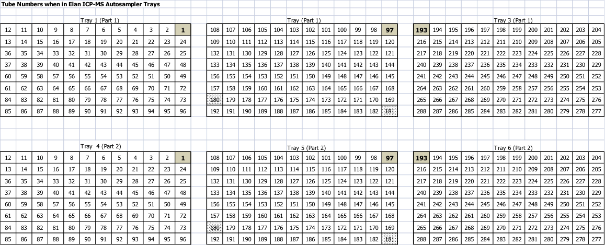

```{r setup, include=FALSE}
require(kfigr)
knitr::opts_chunk$set(echo = TRUE)
```

## Overview of robot functions

* The robot tracks (nonbarcoded) tubes by rack and position in rack.
    * All racks need a unique ID - these are labeled on the side of the tubes (e.g. A{1-5})
    * In addition - each rack needs a unique ID for taring. - e.g. A{1-5}_YYMMDDp1
* Robot output will have 
    * Output Columns (these are customizable)
      * rackID, position (1-60), tare weight, last weight, and net weight
    * The output report is copied to the 'SiriusReports' Google Drive and the 'SiriusAutomation' folder on the desktop
* Rack taring
    * Racks should assigned to an experiment and tared after washing and drying
    * Record which experiment the rack is assigned to in the 'Baxter lab Shipment tracker' Google Sheet

## Software

* SiriusSlate PDA
    * Robot control software
    * Daily Use:
      * Login: BAXTERLAB
      * Password: ionomics
    * Administrator:
      * Login: SAI
      * Password: sirius
* Baxter Lab Google Drive
    * Google Drive account for robot to place files:
      * ddpscbaxtersirius@gmail.com 
      * Password is written on label inside tube cabinet.
* Report output is saved to two locations:
    * C:/SiriusAutomation/SiriusSlate PDA/report/
    * Google Drive -> G:/Ionomics Files/SiriusReports/
      * This path can be modified by going to 'Workstation Configurations' > 'Advanced' > 'File Management'
    
## Tare Tubes

1. Load clean racks onto robot
    * Racks fit into labeled positions on the robot. There are springs on the bumpers to help racks fit snuggly in place.
    * Tube position '1' (marked with green tape) in each rack goes in the back left position.
    * The robot follows the original weighing robot serpentine sample pattern:
        * The first 3 racks follow a serpentine pattern - tube numbers 1-180.
        * Serpentine numbering resets for rack number 4 in the set (tube number 181 starts at top left).
1. After loading ensure racks are sitting flat against the robot deck.
1. Inspect tubes for any abnormalities: broken tubes, tall tubes, or any that don't otherwise sit normally in the racks.
    * Replace with clean tubes as necessary.
1. Highlight job to be run and click 'Run'
    * '5 Racks 288' - to tare all 5 racks
1. Fill in prompts for ID of each rack:
    * RackID is the unique combination of the label on the rack and a date/part in YYMMDDpX format
      * Example for 5 racks: K1_220215p1,K2_220215p1,K3_220215p1,K4_220215p1,K5_220215p1
1. Enter name of output file:
    * This should be the same as the date used above in YYMMDDpX format
      * Example: 220215p1 Weights.tare.csv
1. Record the RackID and Date in the 'Baxter Lab Shipment Tracker' sheet
1. The robot will weigh each tube.
1. Check that Net Weight column in report file is 0 (since this is the Tare run)

## Adding tissue to tubes

1. Open empty sample log template:
    * An empty sample log is a csv file with three columns:
      * RackID, numinSet, sample
      * RackID is the ID on the side of the rack (e.g. A1-A5)
      * numinSet is the tube number (1-288)
1. Save sample log as 'YYMMDDpX Sample Log.csv'
1. Ensure tubes have been tared by checking for tare file (e.g. YYMMDDpX Weights.tare.csv)
1. Record sample id into 'sample' column
1. Aliquot out tissue into digestion tube (acid washed 11ml 16mmx100mm borosilicate glass)
    1. For leaves, roots, and shoots:
        1. Dry tissue in coin envelopes in 50C oven for minimum of 48 hrs.
        1. Homogenize tissue (hand crushing is usually sufficient, but mortar and pestle can be used)
        1. Subsample and aliquot ~75mg (if possible) into test tube.
    1. See tube number diagram for tube numbering (Figure \@ref(fig:plot-ref)).

## Weigh Tubes

1. Load filled racks onto robot
    * Racks fit into labeled positions on the robot. There are springs on the bumpers to help racks fit snuggly in place.
    * Tube position '1' (marked with green tape) in each rack goes in the back left position.
1. After loading ensure racks are sitting flat against the robot deck.
1. Highlight job to be run and click 'Run'
    * '5 Racks 288' - to weight all 5 racks
1. Fill in prompts for ID of each rack:
    * **Rack IDs used must be the same IDs used when taring the racks.**
      * The robot will automatically subtract the the weights and calculate net weight of samples.
    * RackID is the unique combination of the label on the rack and a date/part in YYMMDDpX format
      * Example for 5 racks: K1_220215p1,K2_220215p1,K3_220215p1,K4_220215p1,K5_220215p1
1. Enter name of output file:
    * This should be the same as the date used above in YYMMDDpX format
      * Example: 220215p1 Weights.csv

## Custom Run - (Weigh Less than 288 tubes, only select tubes)

1. Protocol to be developed

------


```{r plot-ref, fig.cap="Tube numbers in the standard 288 test tubes.", warning=FALSE, message=FALSE, echo=FALSE, fig.align = 'left', fig.width = 12, fig.asp = 1.2, out.width = "150%"}
library(ggplot2)
library(dplyr)
library(reshape2)
tubeSet <- matrix(c(1:288),nrow=12,ncol=24)
makeSerpentine <- function(rack){
  for(i in seq(2,ncol(rack),2)){
    rack[,i] <- rev(rack[,i])
  }
  return(rack)
}
tubeSet[,1:15] <- makeSerpentine(tubeSet[,1:15])
tubeSet[,16:24] <- makeSerpentine(tubeSet[,16:24])

#as.data.frame(tubeSet)
colors <- c(rep("Rack 1",60),rep("Rack 2",60),rep("Rack 3",60),rep("Rack 4",60),rep("Rack 5",48))

tubeOrder <- data.frame(numinSet=melt(t(tubeSet))$value,Row=melt(t(tubeSet))$Var1,Column=melt(t(tubeSet))$Var2)

tubeOrder$rackID <- NA
tubeOrder$rackID[tubeOrder$numinSet <= 60] <- "Rack 1"
tubeOrder$rackID[tubeOrder$numinSet > 60] <- "Rack 2"
tubeOrder$rackID[tubeOrder$numinSet > 120] <- "Rack 3"
tubeOrder$rackID[tubeOrder$numinSet > 180] <- "Rack 4"
tubeOrder$rackID[tubeOrder$numinSet > 240] <- "Rack 5"

##Need to highlight tubes 1, 72, 121, 181, 252###
#As the location of the top left tube in each rack
tubeOrder$rackID[tubeOrder$numinSet %in% c(1,72,121,181,252)] <- "Location Marked\nwith Green Sticker"

tubeOrderForLog <- tubeOrder[,c("rackID","numinSet")]

#write.table(tubeOrderForLog,"ColumnwiseTubeFillingOrder.csv",sep=",",row.names=F,col.names=T)

allTubes <- ggplot(data=tubeOrder, aes(x=Column, y=Row)) +
  geom_point(aes(colour = factor(rackID)), size = 8.5) + 
  geom_text(aes(label=numinSet),size=4) +
  coord_fixed(ratio=(13/12)/(25/24), xlim=c(0.5, 12.5), ylim=c(0.5, 24.5)) +
  scale_y_continuous(breaks=seq(1, 24)) + #, labels=LETTERS[1:24]) +
  scale_x_continuous(breaks=seq(1, 12)) +
  labs(color="RackID") +
  scale_color_brewer(palette = "Pastel1")+
  theme_bw()

allTubes

```


```{r plot-ref2, fig.cap="Tube numbers in the 96-well autosampler trays.", echo=FALSE}

```


<!-- # ```{r plot-ref, fig.cap="Tube numbers in the standard 288 test tubes.", echo=FALSE} -->
<!-- # knitr::include_graphics("TubeNumberinginRack.png") -->
<!-- # ``` -->

