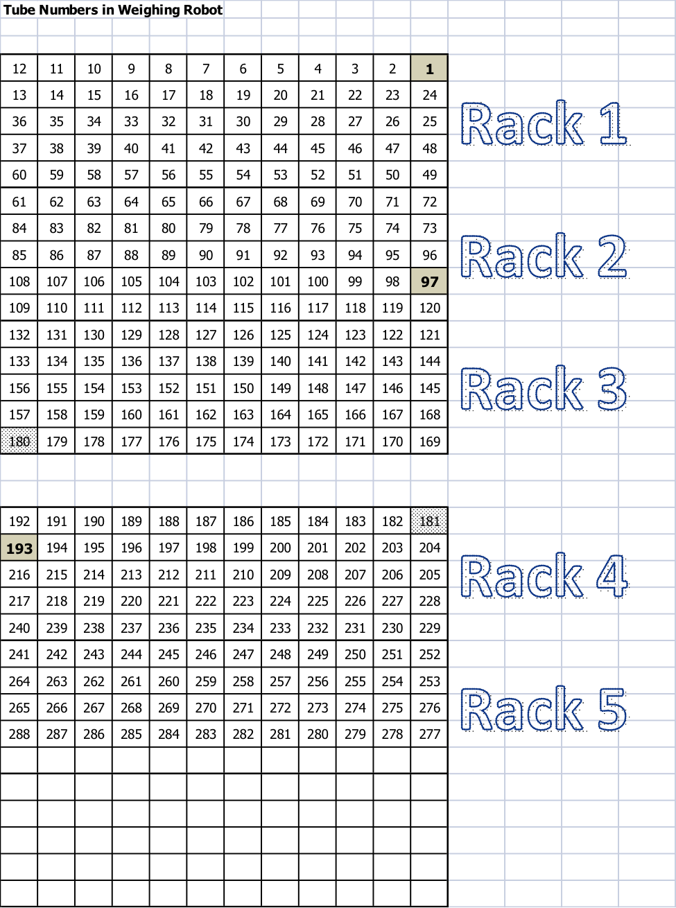

Sample Preparation for Seed/Leaf/Root/Shoot samples
---------------------------------------------------

1.  Weigh out tissue into digestion tube (acid washed 11ml 16mmx100mm
    borosilicate glass)
    1.  Use weighing robot for seeds between 50 and 400 milligrams, see
        weighing robot protocol for procedure and maintenance.
        1.  Sort into 48-well trays following template on computer
            with balance.
            1.  Use YYMMDDpX Sample Log.csv for file name, if you want
                add short description YYMMDDpX Sample Log (short
                description).csv

    2.  For leaves, roots, and shoots:
        1.  Dry tissue in coin envelopes in 50C oven for minimum of
            48 hrs.
        2.  Homogenize tissue (hand crushing is usually sufficient, but
            mortar and pestle can be used)
        3.  Subsample and weigh 75mg (if possible) into test tube.
        4.  Name with YYMMDDpX Sample Log and Weights.csv or YYMMDDpX
            Sample Log and Weights (short description).csv

        -   **Note**: Hand-weighed samples should be recorded into
            spreadsheet in grams using the balances automated button.

    3.  See tube number diagram for tube numbering (Figure ).
    4.  See appendix for protocols used for more diverse samples.

2.  Pre-Digestion:
    1.  If average sample size is greater than 25mg:
        1.  Add 2.5 ml HNO**3 soln (HNO**3 soln =
            20 ppb In in conc HNO**3; 50*μ*L of 1000 ppm
            Indium added to **new** 2.5 L bottle of conc
            HNO**3).

    2.  For experiments where average sample is less than 25mg:
        1.  Add 1 ml HNO**3 soln (HNO**3 soln = 20
            ppb In in conc HNO**3; 50*μ*L of 1000 ppm Indium
            added to **new** 2.5 L bottle of conc HNO**3).

    -   **Note**: This is the most important step of sample preparation.
        Be certain the bottle-top dispenser is working properly (watch
        for air in he dispenser syringe) and make sure that each pump is
        delivering the correct amount to each tube. This can be checked
        gravimetrically if necessary.

3.  Put tubes in heating blocks.
4.  Let stand at room temperature for minimum of 1.5 hours (typically
    overnight), to prevent boiling over.
5.  Digestion: Turn on warming block, set to maximum temperature (~95C).
    Digest for minimum of 4 hrs (until clear, with no residue on sides).
    -   Digest all samples that will be run together for the same amount
        of time.

6.  Turn off heating block and let cool for about 1 hr. Move samples
    back into test tube racks.
7.  Dilute 4x with 18M*ω* H**2O (UPW):
    1.  Large samples experiments (average &gt;25mg):
        1.  Dilute to 10 ml (about 7.7 ml, estimate based on amount
            of evaporation).

    2.  Small samples experiments (average &lt;25mg):
        1.  Dilute to 4 ml (about 3 ml, estimate based on amount
            of evaporation).

8.  Mix with stirring rod block.
    -   Rinse stirring rod block between racks in 10%
        HNO**3 solution.
    -   **Note**: Getting a homogeneous mixture in this step is
        very important. We have tested doing this by: Shaking the tubes,
        pipetting up and down, and letting samples heat after dilution.
        All of these resulted in more variability of Indium, indicating
        poor mixing of the acid in the final sample.

9.  Transfer 1.2 mL of sample to 96-well autosampler tray and load on
    autosampler (Figure ).
    -   **Note**: The orange sticker is placed on the autosampler tray
        for the proper tray orientation. This should be on the top left.
        Which is different from the racks which have the green sticker
        in the top right.

Standard and Control Solutions
------------------------------

1.  Prepare standard stock solution as listed in Table .
2.  Table contains the dilutions for each of 6 standards. These are
    currently handled by the prepFAST autodiluter and only the 'Std Blk'
    and 'Std 6' need to be prepared. Table contains the final standard
    concentrations of the 6 standards.
3.  Control
    -   Prepare a bulk control solution for each tissue/organism type by
        combining left over sample digests into a large plastic bottle
        -   Depending on experiment this should either be a 500mL bottle
            or a large 4L bottle.
        -   Except in the case of soybean and corn seeds these controls
            should be named as follows:
            -   Organism Tissue Date
        -   Once used for an experiment it is **imperative** that the
            control solution not change. If more control is needed, it
            should be prepared in a new bottle with a new control name.

4.  This tissue/organism matched control solution is placed on the
    autosampler in 50mL centrifuge tubes and run every
    10th sample. This helps correct for drift both within an
    ICP-MS run and between ICP-MS runs which may occur weeks or
    months apart.
5.  Analyze using NexION ICP-MS (Refer to Nexion ICP-MS
    Instrument Procedure)

Conversion of *μ*g analyte/L solution (ppb) to mg analyte/kg sample (ppm)
-------------------------------------------------------------------------

The stanrd analytical procedure for seeds dilutes a weighed sample (X
mg) into 10 mL of solution. This dilution is analyzed using the NexION,
which gives results as ppb analyte. To convert to mg analyte/kg sample
use this equation:

$$\\dfrac{Y \\mu g\\ Analyte}{1000 mL\\ Dilution\\ 1}\\dfrac{10mL\\ Dilution\\ 1}{X\\ mg\\ Sample}\\dfrac{1mg\\ Analyte}{1000\\mu g\\ Analyte}\\dfrac{10^6mg\\ Sample}{1kg\\ Sample} = $$
$$\\dfrac{Y \\mu g\\ Analyte}{X mg Sample}(10) = Z\\dfrac{mg\\ Analyte}{kg\\ Sample}$$

$$\\pagebreak$$

Tables and Figures
------------------

<table style="width:112%;">
<caption> Reagent volumes and final concentrations to make ionomics standard stock solution</caption>
<colgroup>
<col width="15%" />
<col width="9%" />
<col width="18%" />
<col width="69%" />
</colgroup>
<thead>
<tr class="header">
<th align="left">Name</th>
<th align="left">Symbol</th>
<th align="right">Final Conc.</th>
<th align="right">Dilution into 500 mL volumetric flask containing 10mL (2%) conc HNO<em></em>3</th>
</tr>
</thead>
<tbody>
<tr class="odd">
<td align="left">Aluminum</td>
<td align="left">Al</td>
<td align="right">100 ppb</td>
<td align="right">50 <em>μ</em>L of 1000 ppm reagent</td>
</tr>
<tr class="even">
<td align="left">Arsenic</td>
<td align="left">As</td>
<td align="right">20 ppb</td>
<td align="right">10 <em>μ</em>L of 1000 ppm reagent</td>
</tr>
<tr class="odd">
<td align="left">Boron</td>
<td align="left">B</td>
<td align="right">250 ppb</td>
<td align="right">125 <em>μ</em>L of 1000 ppm reagent</td>
</tr>
<tr class="even">
<td align="left">Cadmium</td>
<td align="left">Cd</td>
<td align="right">2 ppb</td>
<td align="right">10 <em>μ</em>L of <strong>1000 ppm soln</strong></td>
</tr>
<tr class="odd">
<td align="left">Calcium</td>
<td align="left">Ca</td>
<td align="right">2 ppm</td>
<td align="right">100 <em>μ</em>L of 10,000 ppm reagent</td>
</tr>
<tr class="even">
<td align="left">Cobalt</td>
<td align="left">Co</td>
<td align="right">2 ppb</td>
<td align="right">10 <em>μ</em>L of <strong>100 ppm soln</strong></td>
</tr>
<tr class="odd">
<td align="left">Copper</td>
<td align="left">Cu</td>
<td align="right">40 ppb</td>
<td align="right">20 <em>μ</em>L of 1000 ppm reagent</td>
</tr>
<tr class="even">
<td align="left">Indium</td>
<td align="left">In</td>
<td align="right">20 ppb</td>
<td align="right">10 <em>μ</em>L of 1000 ppm reagent</td>
</tr>
<tr class="odd">
<td align="left">Iron</td>
<td align="left">Fe</td>
<td align="right">400 ppb</td>
<td align="right">200 <em>μ</em>L of 1000 ppm reagent</td>
</tr>
<tr class="even">
<td align="left">Magnesium</td>
<td align="left">Mg</td>
<td align="right">50 ppm</td>
<td align="right">2.5 mL of <strong>10,000 ppm soln<a href="#fn1" class="footnoteRef" id="fnref1">1</a></strong></td>
</tr>
<tr class="odd">
<td align="left">Sulfur</td>
<td align="left">S</td>
<td align="right">66 ppm</td>
<td align="right"><strong>13,193 ppm soln, Included in Mg soln above</strong></td>
</tr>
<tr class="even">
<td align="left">Manganese</td>
<td align="left">Mn</td>
<td align="right">500 ppb</td>
<td align="right">250 <em>μ</em>L of 1000 ppm reagent</td>
</tr>
<tr class="odd">
<td align="left">Molybdenum</td>
<td align="left">Mo</td>
<td align="right">20 ppb</td>
<td align="right">10 <em>μ</em>l of 1000 ppm reagent</td>
</tr>
<tr class="even">
<td align="left">Nickel</td>
<td align="left">Ni</td>
<td align="right">10 ppb</td>
<td align="right">5 <em>μ</em>l of 1000 ppm reagent</td>
</tr>
<tr class="odd">
<td align="left">Phosphorous</td>
<td align="left">P</td>
<td align="right">100 ppm</td>
<td align="right">5 mL of 10,000 ppm reagent</td>
</tr>
<tr class="even">
<td align="left">Potassium</td>
<td align="left">K</td>
<td align="right">150 ppm</td>
<td align="right">7.50 mL of 10,000 ppm reagent</td>
</tr>
<tr class="odd">
<td align="left">Rubidium</td>
<td align="left">Rb</td>
<td align="right">100 ppb</td>
<td align="right">50.0 <em>μ</em>L of 1000 ppm reagent</td>
</tr>
<tr class="even">
<td align="left">Selenium</td>
<td align="left">Se</td>
<td align="right">40 ppb</td>
<td align="right">20 <em>μ</em>L of 1000 ppm reagent</td>
</tr>
<tr class="odd">
<td align="left">Sodium</td>
<td align="left">Na</td>
<td align="right">80 ppb</td>
<td align="right">40 <em>μ</em>L of 1000 ppm reagent</td>
</tr>
<tr class="even">
<td align="left">Strontium</td>
<td align="left">Sr</td>
<td align="right">100 ppb</td>
<td align="right">50.0 <em>μ</em>L of 1000 ppm reagent</td>
</tr>
<tr class="odd">
<td align="left">Zinc</td>
<td align="left">Zn</td>
<td align="right">1000 ppb</td>
<td align="right">500.0 <em>μ</em>L of 1000 ppm reagent</td>
</tr>
</tbody>
</table>

<ol>
<li id="fn1">
Prepared from 50.704g MgSO<em></em>4.7H<em></em>2O / 500mL UPW<a href="#fnref1">↩</a>
</li>
</ol>

<table>
<caption> Prepare each standard in a 50mL centrifuge tube contaning 2.25mL HNO<em></em>3 and add UPW to 50mL mark.</caption>
<thead>
<tr class="header">
<th align="left"></th>
<th align="left">Standard stock volume</th>
<th align="right">Dilution factor from std stock</th>
<th align="left">Autosampler Position</th>
</tr>
</thead>
<tbody>
<tr class="odd">
<td align="left">Std Blank</td>
<td align="left">0 mL</td>
<td align="right">0.000</td>
<td align="left">1</td>
</tr>
<tr class="even">
<td align="left">Std 1</td>
<td align="left">0.250 mL</td>
<td align="right">0.005</td>
<td align="left"></td>
</tr>
<tr class="odd">
<td align="left">Std 2</td>
<td align="left">0.500 mL</td>
<td align="right">0.010</td>
<td align="left"></td>
</tr>
<tr class="even">
<td align="left">Std 3</td>
<td align="left">1.00 mL</td>
<td align="right">0.025</td>
<td align="left"></td>
</tr>
<tr class="odd">
<td align="left">Std 4</td>
<td align="left">2.50 mL</td>
<td align="right">0.050</td>
<td align="left"></td>
</tr>
<tr class="even">
<td align="left">Std 5</td>
<td align="left">5.00 mL</td>
<td align="right">0.100</td>
<td align="left"></td>
</tr>
<tr class="odd">
<td align="left">Std 6</td>
<td align="left">12.50 mL</td>
<td align="right">0.250</td>
<td align="left">2</td>
</tr>
<tr class="even">
<td align="left">Std Stk</td>
<td align="left">50mL</td>
<td align="right">1.000</td>
<td align="left">3</td>
</tr>
</tbody>
</table>

<table>
<caption> Concentration in standards (After dilution by prepFAST autodiluter), NexION ICP-MS.</caption>
<thead>
<tr class="header">
<th align="left">Name</th>
<th align="right">Std 1 (ppb)</th>
<th align="right">Std 2 (ppb)</th>
<th align="right">Std 3 (ppb)</th>
<th align="right">Std 4 (ppb)</th>
<th align="right">Std 5 (ppb)</th>
<th align="right">Std 6 (ppb)</th>
</tr>
</thead>
<tbody>
<tr class="odd">
<td align="left">Boron</td>
<td align="right">1.25</td>
<td align="right">2.5</td>
<td align="right">6.25</td>
<td align="right">12.5</td>
<td align="right">25</td>
<td align="right">62.5</td>
</tr>
<tr class="even">
<td align="left">Sodium</td>
<td align="right">0.4</td>
<td align="right">0.8</td>
<td align="right">2</td>
<td align="right">4</td>
<td align="right">8</td>
<td align="right">20</td>
</tr>
<tr class="odd">
<td align="left">Magnesium</td>
<td align="right">250</td>
<td align="right">500</td>
<td align="right">1250</td>
<td align="right">2500</td>
<td align="right">5000</td>
<td align="right">12500</td>
</tr>
<tr class="even">
<td align="left">Aluminum</td>
<td align="right">0.5</td>
<td align="right">1</td>
<td align="right">2.5</td>
<td align="right">5</td>
<td align="right">10</td>
<td align="right">25</td>
</tr>
<tr class="odd">
<td align="left">Phosphorous</td>
<td align="right">500</td>
<td align="right">1000</td>
<td align="right">2500</td>
<td align="right">5000</td>
<td align="right">10000</td>
<td align="right">25000</td>
</tr>
<tr class="even">
<td align="left">Sulfur</td>
<td align="right">329.8</td>
<td align="right">659.6</td>
<td align="right">1649</td>
<td align="right">3298</td>
<td align="right">6596</td>
<td align="right">16490</td>
</tr>
<tr class="odd">
<td align="left">Potassium</td>
<td align="right">750</td>
<td align="right">1500</td>
<td align="right">3750</td>
<td align="right">7500</td>
<td align="right">15000</td>
<td align="right">37500</td>
</tr>
<tr class="even">
<td align="left">Calcium</td>
<td align="right">10</td>
<td align="right">20</td>
<td align="right">50</td>
<td align="right">100</td>
<td align="right">200</td>
<td align="right">500</td>
</tr>
<tr class="odd">
<td align="left">Manganese</td>
<td align="right">2.5</td>
<td align="right">5</td>
<td align="right">12.5</td>
<td align="right">25</td>
<td align="right">50</td>
<td align="right">125</td>
</tr>
<tr class="even">
<td align="left">Iron</td>
<td align="right">2</td>
<td align="right">4</td>
<td align="right">10</td>
<td align="right">20</td>
<td align="right">40</td>
<td align="right">100</td>
</tr>
<tr class="odd">
<td align="left">Cobalt</td>
<td align="right">0.01</td>
<td align="right">0.02</td>
<td align="right">0.05</td>
<td align="right">0.1</td>
<td align="right">0.2</td>
<td align="right">0.5</td>
</tr>
<tr class="even">
<td align="left">Nickel</td>
<td align="right">0.05</td>
<td align="right">0.1</td>
<td align="right">0.25</td>
<td align="right">0.5</td>
<td align="right">1</td>
<td align="right">2.5</td>
</tr>
<tr class="odd">
<td align="left">Copper</td>
<td align="right">0.2</td>
<td align="right">0.4</td>
<td align="right">1</td>
<td align="right">2</td>
<td align="right">4</td>
<td align="right">10</td>
</tr>
<tr class="even">
<td align="left">Zinc</td>
<td align="right">5</td>
<td align="right">10</td>
<td align="right">25</td>
<td align="right">50</td>
<td align="right">100</td>
<td align="right">250</td>
</tr>
<tr class="odd">
<td align="left">Arsenic</td>
<td align="right">0.1</td>
<td align="right">0.2</td>
<td align="right">0.5</td>
<td align="right">1</td>
<td align="right">2</td>
<td align="right">5</td>
</tr>
<tr class="even">
<td align="left">Selenium</td>
<td align="right">0.2</td>
<td align="right">0.4</td>
<td align="right">1</td>
<td align="right">2</td>
<td align="right">4</td>
<td align="right">10</td>
</tr>
<tr class="odd">
<td align="left">Rubidium</td>
<td align="right">0.5</td>
<td align="right">1</td>
<td align="right">2.5</td>
<td align="right">5</td>
<td align="right">10</td>
<td align="right">25</td>
</tr>
<tr class="even">
<td align="left">Strontium</td>
<td align="right">0.5</td>
<td align="right">1</td>
<td align="right">2.5</td>
<td align="right">5</td>
<td align="right">10</td>
<td align="right">25</td>
</tr>
<tr class="odd">
<td align="left">Molybdenum</td>
<td align="right">0.1</td>
<td align="right">0.2</td>
<td align="right">0.5</td>
<td align="right">1</td>
<td align="right">2</td>
<td align="right">5</td>
</tr>
<tr class="even">
<td align="left">Cadmium</td>
<td align="right">0.01</td>
<td align="right">0.02</td>
<td align="right">0.05</td>
<td align="right">0.1</td>
<td align="right">0.2</td>
<td align="right">0.5</td>
</tr>
</tbody>
</table>

$$\\pagebreak$$

[1] Prepared from 50.704g MgSO**4.7H**2O / 500mL
UPW
